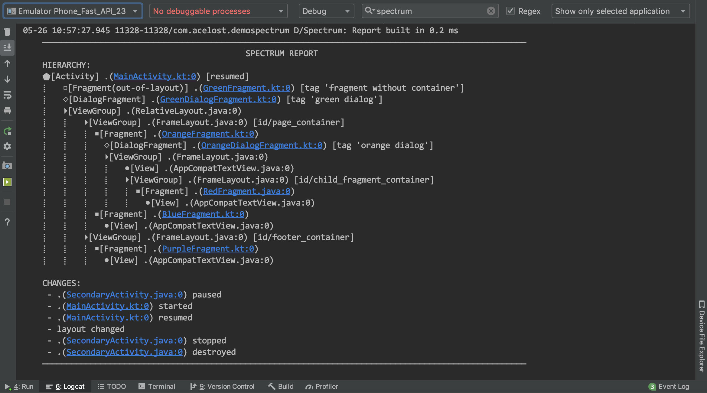
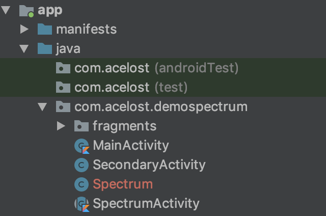

# Spectrum

[![Bintray][bintraybadge-svg]][bintray]

A fast UI hierarchy inspector for Android applications.

# Why do you need it

We all love to write code. 
I'm sure we know every class, every method, every variable that we have ever created or edited. 
Man's code is his castle. 
But one day we have to go to another castle. 
And what will we see there? 
At first glance, this is all the same familiar code. 
All the same `Activities`, `Fragments` and what else is there in the Android. 
But the application is large and it will take a lot of time to study its structure.

And here `Spectrum` comes to the rescue. 
This utility will monitor changes in the application and print actual `Activity-Fragment-View` connections tree to the logcat. 
Now, it will take much less time to find the class in which you need to correct `TextView` text color from the bug report screenshot.

## How to use

To enable `Spectrum` just add this line into `onCreate` method of your activity:

```java
public void onCreate(Bundle savedInstanceState) {
    Spectrum.explore(this);
    // your perfect code
}
```

Or if you want to inspect all activities add this line into `onCreate` method of your `Application` class:

```java
public void onCreate() {
    Spectrum.explore(this);
    // your perfect code again
}
```

Now you will see something like this in IDE logcat:



## How to integrate

You can add source file 
[Spectrum.java][spectrum-java-src] 
to your project sources if you want to test the library or if you need to use it once.
This file contains all the basic functionality of the utility.



In order to use the library to its fullest, add new gradle dependency:

```groovy
implementation 'com.acelost.spectrum:spectrum:0.0.1'
```

## How to configure
 TODO
## F.A.Q.
 TODO
 
Do you still have questions? Ask them in Telegram group [t.me/spectrum_android][telegram-group].

## License

    Copyright 2019 The Spectrum Author

    Licensed under the Apache License, Version 2.0 (the "License");
    you may not use this file except in compliance with the License.
    You may obtain a copy of the License at

       http://www.apache.org/licenses/LICENSE-2.0

    Unless required by applicable law or agreed to in writing, software
    distributed under the License is distributed on an "AS IS" BASIS,
    WITHOUT WARRANTIES OR CONDITIONS OF ANY KIND, either express or implied.
    See the License for the specific language governing permissions and
    limitations under the License.
    
[bintray]: https://bintray.com/acelost/Spectrum/spectrum
[bintraybadge-svg]: https://img.shields.io/bintray/v/acelost/Spectrum/spectrum.svg
[spectrum-java-src]: https://github.com/acelost/Spectrum/blob/master/spectrum/src/main/java/com/acelost/spectrum/Spectrum.java
[telegram-group]: https://t.me/joinchat/BQAcsRNDjEsjdCEe_F_00w
